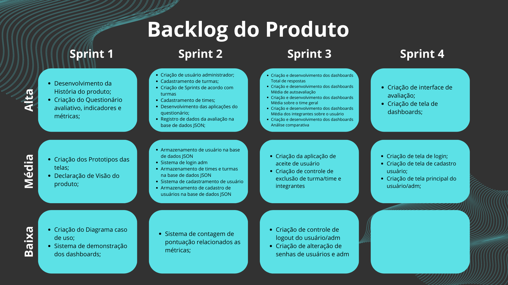

# <h1 align="center">Sprint 1 - Insight 360º👁️‍🗨️</h1>

# ÍNDICE
[Integrantes](#INTEGRANTES)  
[Cronograma de entrega](#CRONOGRAMA-DE-ENTREGAS)  
[Visão do Produto](#VISÃO-DO-PRODUTO)  
[Objetivo](#OBJETIVO)  
[História do produto](#HISTÓRIA-DO-PRODUTO)  
[Diagrama Caso de Uso](#DIAGRAMA-CASO-DE-USO)  
[Backlog sprint 1](#BACKLOG-DO-PRODUTO)  
[Avaliação](#AVALIAÇÃO)  
[Dashboards](#DASHBOARDS)  
[Planejamento](#PLANEJAMENTO)  

# <h1 align="center">INTEGRANTES 👨‍💻👩‍💻</h1>
- Amanda Vannucci de Campos (Product Owner)
- André Filipe Meneses (Scrum Master)
- Gilvane de Souza Amaro Junior (Dev)
- Jhony Santos de Souza (Dev)
- Lucas Lima Martins Pereira (Dev)
- Raul José Batista Neto (Dev)
- Vinicius Domingues Mangaba (Dev)

# <h1 align="center">CRONOGRAMA DE ENTREGAS📆</h1>
    ✅  **Kick off do projeto** - 07/03/2023 
    ✅  **Sprint 1** - Início: 13/03/2023 Entrega: 02/04/2023
    
# <h1 align="center">VISÃO DO PRODUTO 👁️‍🗨️</h1>

O software é uma aplicação desktop desenvolvida em Python que oferece aos usuários a possibilidade de realizar avaliações e fornecer feedbacks através de dashboards. Ao contrário de sistemas de avaliação comuns, essa ferramenta promove testes coletivos, que têm um impacto direto na produtividade e no desempenho dos membros da equipe.

# <h1 align="center">OBJETIVO 🎯</h1>

O objetivo é fornecer ao cliente uma solução simples e eficaz, utilizando uma ferramenta objetiva, interativa, de fácil acesso e que apresente resultados imediatos.

# <h1 align="center">HISTÓRIA DO PRODUTO 📚</h1>
- Login e senha de acesso do Administrador. 
- Cadastro de usuários (simplificado). 
- Controles do administrador. 
     Criação de turma; 
     Criação de time; 
     Controle de acesso de usuário; 
     Aceite e remoção de usuário. 
- Avaliação 360, modelo de avaliação direta. 
- Dashboard com gráficos, contendo as seguintes informações: 
     Total de respostas; 
     Média de autoavaliação; 
     Média sobre o time geral; 
     Média dos integrantes sobre o usuário; 
     Análise comparativa. 

# <h1 align="center">DIAGRAMA CASO DE USO 🧍‍♀️🧍‍♂️</h1>

# <h1 align="center">BACKLOG DO PRODUTO</h1>

# <h1 align="center">AVALIAÇÃO 📜</h1>
<h2>Questionário: </h2>
- Como você avalia sua comunicação com o grupo durante essa Sprint? 
- Como você avalia o seu trabalho em equipe durante essa Sprint? 
- Como você avalia sua proatividade durante essa Sprint? 
- Como você avalia sua produtividade durante essa Sprint? 
- Como você avalia sua entrega com relação ao prazo do projeto nessa Sprint? 
  <h2>Indicadores: </h2>
- Comunicação;  
- Trabalho em equipe;  
- Proatividade;  
- Produtividade;  
- Prazo de entrega. 
  <h2>Métricas: </h2>
- Muito ruim; 
- Ruim; 
- Regular; 
- Bom; 
- Muito bom; 
  
# <h1 align="center">DASHBOARDS 📈</h1>
  

# <h1 align="center">PLANEJAMENTO 🔍</h1>
  <h2>Ferramentas</h2>
- Python 
- JSON 
- Tkinter 
- Matplotlib 
- Notion 
- Discord 
- Diagrams.net 
- Git e Github 
- Canva (Apresentação) 
- Excel (Demonstração dashboard) 

<h2>Metodologias Ágeis: </h2>
- Scrum (principal) 
- Kanban 

